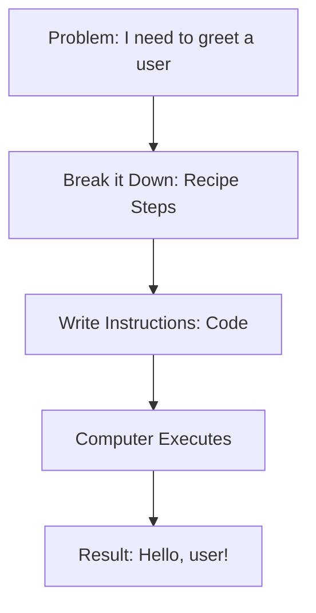

# What is Programming?

> Programming is the process of giving a computer a set of instructions to perform a specific task. Think of it like writing a recipe for a computer to follow.

At its core, programming is about problem-solving. You take a problem, break it down into smaller, more manageable steps, and then write instructions (code) for each of those small steps. The computer then executes these instructions in sequence to achieve the desired outcome.

These instructions are written in a special language that the computer can understand, called a **programming language**. There are many different programming language, each with its own strengths and weaknesses, but they all serve the same fundamental purpose: to bridge the communication gap between humans and computers.

The people who write these instructions are called **programmers** or **developers**. They use their creativity and logical thinking to build all sorts of amazing things, from websites and mobile apps to video games and artificial intelligence.

## Coding vs. Programming

While often used interchangeably, "coding" and "programming" have slightly different meanings.

- **Coding** is the act of translating logic into a language a computer understands. It's the part where you write the actual lines of code.
- **Programming** is a broader process that includes coding, but also involves planning, designing, debugging, and testing a complete program.

In simple terms, coding is a part of programming.

## You Don't Have to Be a Professional Developer to Code

In the past, creating software was almost exclusively the domain of professional programmers and developers. However, the rise of Artificial Intelligence (AI) is changing that. Nowadays, AI tools can help you write code, debug it, and even learn programming concepts.

Think of modern AI as your personal coding assistant. It can help you find mistakes or translate a plain-English idea into code, but you are still the chef. This guide will teach you how to read the recipe and guide your assistant effectively.
